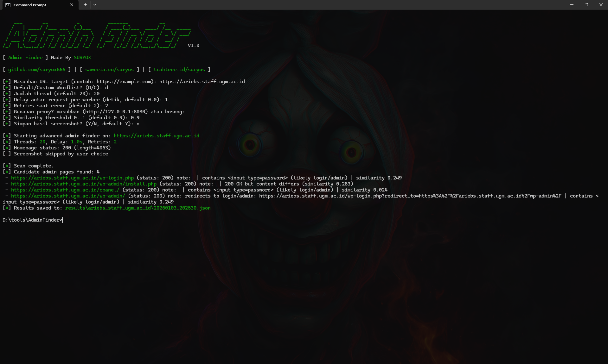
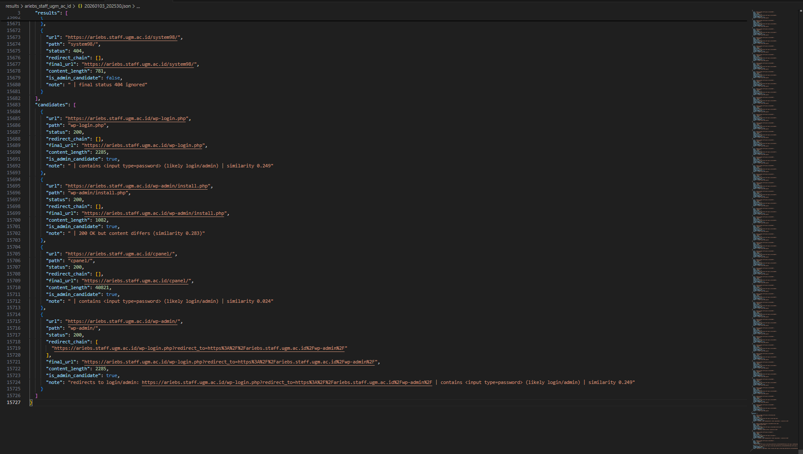

# Admin Finder V1.0
### by suryox


Admin Finder V1.0 adalah **advanced admin panel discovery tool** yang dirancang untuk membantu proses **penetration testing, CTF, dan security research** secara **legal dan berizin**.

Tool ini tidak hanya melakukan brute-force path admin, tetapi menggunakan **heuristik cerdas** seperti analisis redirect, deteksi form login, dan perbandingan kemiripan konten dengan homepage untuk mengurangi false positive.

---

## 📸 Screenshot

> Contoh hasil scanning & screenshot admin candidate




> 📌 *Screenshot di atas hanyalah contoh. Hasil aktual tergantung target.*

---

## 🚀 Fitur Utama

- 🔍 Smart admin panel discovery
- 🧠 Similarity analysis (homepage vs target page)
- 🔐 Login form detection (`<input type="password">`)
- 🚦 HTTP status heuristic (403 dianggap resource exists)
- ⚡ Multi-threaded scanning
- 🌐 Default & custom wordlist
- 🧪 Proxy support (Burp / MITM)
- 📸 Optional screenshot capture (Playwright)
- 📄 Structured JSON output
- 🎨 Colored CLI output & progress bar
- 🖥️ Interactive CLI mode

---

## 📦 Install Dependencies

Pastikan menggunakan **Python 3.8+**

### 1. Kloning repositori:
```bash
git clone https://github.com/suryox666/AdminFinder
cd AdminFinder
```

### 2. Install dependencies:
```bash
pip install -r requirements.txt
```

## 🔍 Cara Menggunakan

```bash
python main.py
```

Lalu masukkan URL target (wajib pakai `http://` atau `https://`), contoh:

```
[+] Masukkan URL target (contoh: https://example.com) : http://example.com
```

---

## 📁 Struktur Direktori

```
AdminFinder/
├── main.py
├── results/
│   └── example_com           # hasil scan tersimpan di sini
│       └── 20260103_202530.json  
│       └── screenshots       # hasil screenshot candidate
│           └── candidate_1.png
│           └── candidate_2.png
│           └── candidate_3.png
├── screenshots/
│   └── priview_candidate.png # contoh screenshot output
│   └── scan.png              # contoh screenshot tools
└── README.md
```

---

## 📄 Contoh Output JSON

```
{
  "target": "https://example.com",
  "candidates": [
    {
      "url": "https://example.com/admin/login.php",
      "status": 200,
      "note": "contains <input type=password> | likely login/admin"
    }
  ]
}
```

---

## ⚠️ Disclaimer

```
Tool ini dibuat hanya untuk tujuan edukasi, CTF, dan pengujian keamanan yang sah.
Segala bentuk penyalahgunaan sepenuhnya menjadi tanggung jawab pengguna.
```

---

## 👤 Author

```
suryox
GitHub: https://github.com/suryox666

"Security is not about breaking systems, but understanding them."
```
